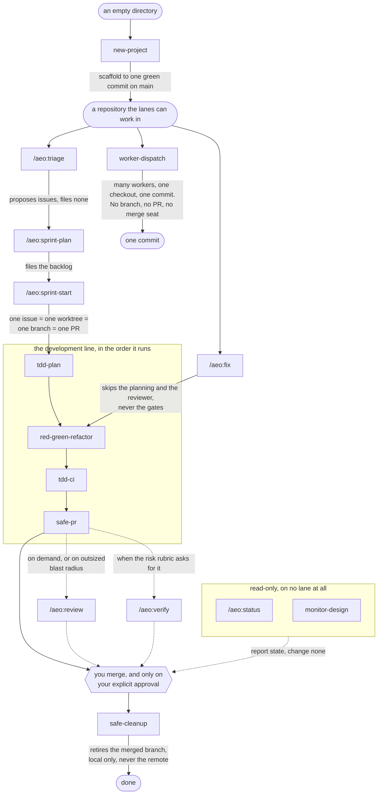

# AEO

A Claude Code plugin that runs a solo-operator AI software shop: a builder
takes work test-first from a GitHub issue to a pull request, on-demand
reviewer and triage roles check it, and hooks enforce the merge and test
rules deterministically instead of by prompt. You stay in the merge seat.
Nothing in this plugin merges a pull request or pushes to your default
branch.

## Before you install: Node is required

Every gate this plugin ships is a Node script, invoked directly by
`hooks/hooks.json`. If Node is not on `PATH`, Claude Code cannot start the
gate process, and a hook that fails to start exits non-zero without exiting
2, which Claude Code treats as non-blocking. The tool call proceeds. Nothing
is refused, nothing is logged as refused, and nothing tells you that.

So this is not a soft recommendation: **install Node 18 or later and put it
on `PATH` before you install this plugin.** A `SessionStart` hook checks for
you and prints one line if it can't find Node:

```
[AEO] GATES NOT ENFORCING: node did not resolve, so every AEO hook fails open.
Install Node 18+ on PATH and restart Claude Code.
```

If you ever see that line, treat the session as ungated until it's fixed.

## Install

A Claude Code marketplace is a repository that publishes plugins, and this
repository is one. The whole mechanism is a single file,
`.claude-plugin/marketplace.json` at the root: it names a marketplace called
`aeo` and one plugin, also called `aeo`, whose source is the `plugin/`
directory sitting beside it. There is no build step, no release artifact, and
nothing to download by hand.

The repository is public. Anyone can install it, and no account, token, or
collaborator access is involved.

From inside a Claude Code session:

```
/plugin marketplace add Muhanad-husn/AEO
/plugin install aeo@aeo
```

Or from a shell, with the CLI:

```
claude plugin marketplace add Muhanad-husn/AEO
claude plugin install aeo@aeo
```

The first command clones this repository and registers it as a marketplace
named `aeo`. The second installs the `aeo` plugin that marketplace publishes.
`aeo@aeo` is `plugin@marketplace`, and both happen to be called `aeo`, so the
doubled name reads like a typo and is not one.

The install lands in Claude Code's own plugin directory. It does not write
into whichever repository you happen to be working in.

### What that installs

Fifteen skills, five agent charters, and six gate scripts wired to two hook
events — `SessionStart` and `PreToolUse`.

**Seven of the fifteen skills are operator-invoked only.** They run when you
type their slash command and never on their own, no matter what you say to
Claude:

```
/aeo:fix   /aeo:review   /aeo:sprint-plan   /aeo:sprint-start
/aeo:status   /aeo:triage   /aeo:verify
```

This matters on the first day more than any other fact about the plugin. If
you describe a sprint in a sentence and wait for `/aeo:sprint-start` to pick
it up, nothing happens, and the plugin looks broken when it is behaving
exactly as designed. Type the command. The remaining eight skills do trigger
on description, so Claude reaches for them mid-session without being asked.
[The lanes](#the-lanes) below shows the whole set and the order the
development ones run in.

## Uninstall

```
claude plugin uninstall aeo@aeo
claude plugin marketplace remove aeo
```

This removes the plugin and the marketplace registration, but not the
installed copy Claude Code keeps at `~/.claude/plugins/cache/`. That cache
is Claude Code's, not this plugin's, and uninstall doesn't reach it. Run
`claude plugin prune` afterward to clear it — that also clears any other
orphaned plugin caches Claude Code is holding, not just this one.

## The lanes

All fifteen skills are below. The seven drawn with a `/aeo:` prefix are the
operator-invoked ones, and `disable-model-invocation: true` in their
frontmatter is what makes them so. The other eight carry no such flag and
fire on their descriptions.



Four things that map is for. The development line runs in one order and
only that order, so a slice that has not been through `tdd-plan` has no
plan for `red-green-refactor` to execute. `/aeo:fix` is a second entrance
to the same line rather than a lane of its own, which is why it skips the
ceremony and not the gates. `worker-dispatch` is the other way to write to
your repository, and it stops at a commit without ever reaching a branch,
a PR, or you. And every path that produces a pull request converges on one
node you own.

**Operator-invoked**

| Skill | What it does |
| --- | --- |
| `fix` | A small, scoped fix straight to a founder-approved PR, skipping sprint planning and the reviewer. |
| `review` | A three-stage read-only review of the current branch's diff against the default branch. |
| `sprint-plan` | Decomposes a phase of the spec into a sprint backlog of GitHub issues. |
| `sprint-start` | Dispatches the builder on the next unblocked issue, or several at once, up to the actor cap. |
| `status` | Renders project state from git and GitHub just now, never from a memory file. |
| `triage` | Turns a raw idea into scoped issue proposals. Proposes, never files. |
| `verify` | Runs an independent verification of a change before it reaches you. |

**Trigger on description**

| Skill | What it does |
| --- | --- |
| `monitor-design` | Designs a job-specific monitoring overlay for one long-running job. |
| `new-project` | Scaffolds a new repository the other skills can work in, to one green commit on `main`. |
| `red-green-refactor` | Double-loop TDD: a failing acceptance test drives inner red/green/refactor cycles. |
| `safe-cleanup` | Retires local branches once their PRs have merged or closed. Never touches the remote. |
| `safe-pr` | Opens a reviewable PR with evidence attached, once a slice is green. |
| `tdd-ci` | Writes the matching GitHub Actions workflow once a slice is green locally. |
| `tdd-plan` | Splits new work into thin, independently valuable vertical slices before any code is written. |
| `worker-dispatch` | Fans a bounded mechanical task across operation workers reaching one commit. |

Five agent charters back these lanes: `builder`, `reviewer`, `triage`,
`verifier`, `monitor-designer`.

## The gates

Six hooks are wired through `hooks/hooks.json`. Five refuse specific
actions; the sixth never blocks anything — it reports.

| Hook | What it refuses |
| --- | --- |
| `sandbox-guard` | Any command or file read/write that would reach declared production data, and running the suite over a job that's still live. |
| `block-merge` | A subagent, or the GitHub forge tool, merging, deleting a branch, or pushing to the protected branch. |
| `commit-gate` | A commit on the protected branch, and a commit while the project's test suite is red or its command can't be detected. |
| `path-guard` | A role subagent editing the harness's own `.claude/` configuration. |
| `review-jail` | The reviewer or verifier role calling any tool but a `Read` of its own staged evidence packet. |
| `session-status` | Nothing — it never blocks. It reports which of the above are actually wired and the project's live state, at the start of every session. |

`claude plugin details` reports **2 hooks** — that counts the event types
these scripts are wired to (`SessionStart`, `PreToolUse`), not the six
scripts themselves. Both numbers are correct; they're counting different
things.

## Who merges

You do. Always. Every lane stops at a pull request and waits for your
approval; the plugin's own roles — builder, reviewer, triage — have no
path to `git merge`, `gh pr merge`, or a push to your default branch, no
matter how they're invoked. Your own session merges, but only once
you've approved it, never on a role's judgment and never before that
approval. That's the product, not a limitation of it.
