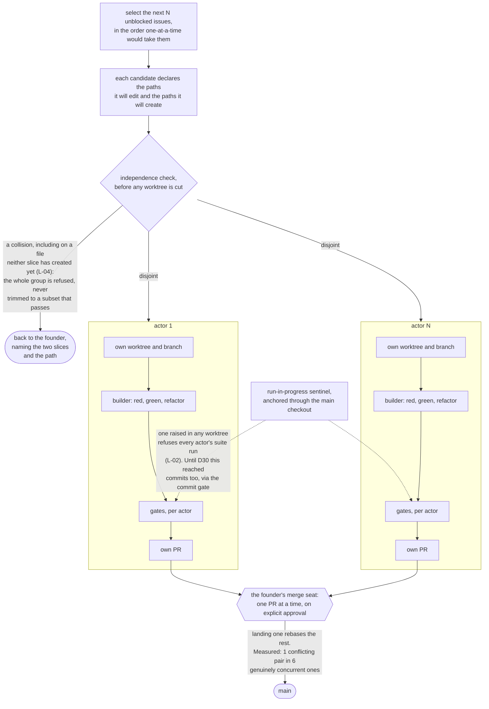

# Build plan

Turn the `agentic-engineering-org` skill into an installable, stack-agnostic Claude
Code plugin distributed from GitHub and a marketplace.

This file is the **execution sequence and the dispatch table** — what happens in what
order, who authors it, at which model tier, and where the checkpoints are.

> **All eight checkpoints are closed as of 2026-08-13.** Phase 6 ran last, out of order,
> because it was deferred at Checkpoint 5 until the plugin had been used and Phase 7's dry
> run was that usage. Read this file from here on as the record of how the build went, not
> as work outstanding. What is left open is named in
> [`MIGRATION.md`](MIGRATION.md)'s gap list — one item, cost and ETA reporting, which no
> phase owns.

| Doc | Answers |
|---|---|
| [`PRINCIPLES.md`](PRINCIPLES.md) | What is fixed and what is proposed. **Authoritative** |
| [`DECISIONS.md`](DECISIONS.md) | What is settled, and why. Includes the enhancement disposition (**EN-*n***) |
| **`PLAN.md`** (this file) | In what order, by whom, with the checkpoints |
| [`EVIDENCE.md`](EVIDENCE.md) | What the build must not get wrong (**C** currency, **V** divergence, **L** lesson) |
| [`INVENTORY.md`](INVENTORY.md) | What was copied, from where, and what was left out |

## What we are building

**One plugin** that ships the harness directly — agents, skills, hooks, scripts — plus
**one slim scaffolder skill** that does only the two things a plugin cannot do for a
specific project: decide the stack and write the project's handbook.

The plugin *is* the harness. Phases 2–5 of the current skill stop being instructions
for generating files and become the files themselves. That is the single largest
simplification available and it comes from the format, not from design work.

## The efficiency spine

The founder's priority is efficiency in building, testing and production validation.
Four rules carry it, and every phase below is checked against them:

1. **Fast signal before iteration.** The commit gate runs a project's *fast tier*,
   resolved by detection — never the full tree. The acceptance layer belongs to CI.
   The countermeasure for the blind spot this creates is L-06's, stated in Phase 2, not
   a wider default.
2. **Verification proportional to risk.** [D4](DECISIONS.md)'s rubric, one rubric with
   two consumers, so the verifier and the merge gate cannot disagree.
3. **Parallel where it is free.** Read-only fan-out is unbounded and lands in Phase 2;
   write concurrency waits for tested worktree resolution ([D11](DECISIONS.md)).
4. **Measure at Phase 2, not only at Phase 7.** The repo has a benchmark
   (with-skill pass rate 1.0 versus 0.27–0.45 without). Nothing may claim the plugin is
   as good as the skill until that number is reproduced against the new shape.

Two standing constraints, checked at every checkpoint:

- **Does this phase remove more than it adds?** Several should shrink the artifact. If
  one only grows it, re-scope.
- **Did anything hit a tripwire?** A hand-tuned constant, a one-implementation
  abstraction, a config nobody sets, a fix larger than its bug. Simplify, or justify in
  one line in the PR body.

## Working method

We dogfood the thing we are building. One branch per slice, one phase at a time, stop
at each checkpoint for approval, report one status
(`DONE` / `DONE_WITH_CONCERNS` / `BLOCKED` / `NEEDS_CONTEXT`). Every founder-facing
question arrives with options, a recommendation, and what it costs.

**Every artifact is authored by a dispatched subagent, with a model matched to the job.
Nothing with content is emitted by a generator.** A script that templates fifteen files
produces fifteen files that read like a template; the uniformity looks like consistency
and is actually absence of thought — and here the artifacts *are* the product. Creating
an empty directory is not generating a file. The line is content: prose, prompts, code,
tests. If a human would read it and form an opinion about it, a subagent writes it.

This rule governs plugin artifacts. The planning documents in `docs/` are the
orchestrator's own work product and are exempt.

### The bootstrap problem, stated plainly

This repo has no harness. We are building the gates that will later govern us, so
Phases 0 and 1 cannot be governed by them. That is a real gap, not a technicality.

Until Phase 1 lands, the substitutes are:

- **Subagents run without merge capability** — via session-wide `permissions.deny`
  rules, which do apply inside subagents. There is no dispatch-time tool override
  (C-08); `model` is the only per-invocation parameter.
- **The orchestrator merges, on founder approval only.** Same rule as the finished
  harness; enforced by discipline instead of exit code 2.
- **`main` stays clean.** One branch per slice, no exceptions, because the
  no-commits-on-`main` gate does not exist yet to catch a slip.
- **No test run touches anything outside this repo.** There is no production data here —
  but the habit is the point, and P1.5 exists precisely because habit was not enough
  last time.

**Dogfooding starts the moment Phase 1 closes.** From Phase 2 onward the gates we built
govern the rest of the build. That transition is the first real proof they work.

### Model assignment

Match the tier to the dominant work in the slice, not to its size.

| Tier | For | Why |
|---|---|---|
| **Haiku** | mechanical work with an unambiguous target — file moves, provenance records, sweeping stale references | No judgment required; paying more buys nothing |
| **Sonnet** | ports and builds against a reference implementation and a written spec | The shape is known; the work is careful execution |
| **Opus** | design under uncertainty, safety-critical logic, and all review | Where a wrong decision compounds across every later phase |

Three things are always Opus regardless of size:

1. **Anything fail-closed.** A guard that fails open is worse than no guard, because it
   advertises safety it does not provide.
2. **Anything every future session inherits.** Agent charters, the handbook, skill
   descriptions. A weak charter is re-read thousands of times.
3. **Review.** The reviewer must sit a tier above the builder or they share failure
   modes, and two instances of one model is a rerun, not an independent check.

---

## Phase 0 — Plugin skeleton, provenance, locked decisions

Cheap, and it makes every later phase's target concrete.

| Slice | Model | Authors | Must not |
|---|---|---|---|
| **P0.1** skeleton | **Sonnet** | `.claude-plugin/plugin.json` (with `$schema` and an explicit `version`, C-09); a minimal `.claude-plugin/marketplace.json` at the repo root, because nothing installs without one ([D15](DECISIONS.md)); the directory shape `agents/ skills/ hooks/ scripts/`; **eleven skill stubs**, each with a real, distinct `description`, written individually; `logs/<YYYY-MM-DD>-<job>/` established in this repo (EN-14) | Template the stubs. A description is what makes a skill trigger; eleven copies of one sentence is eleven skills that compete |
| **P0.2** provenance | **Haiku** | Upstream LICENSE in place; `VENDORED.md` recording source, the `593e7ab` SHA, and what was adapted (V-14) | Paraphrase the licence |
| **P0.3** roster | **Haiku** | Roster reduced to three — builder, reviewer, triage; every dangling `spec-author` reference swept (V-07) | Touch vendored sources — they are frozen |

**Skills only, no `commands/`** ([D9](DECISIONS.md)). The six operator lanes
(`sprint-plan`, `sprint-start`, `fix`, `review`, `triage`, `status`) carry
`disable-model-invocation: true`. The five harness skills (`safe-pr`, `safe-cleanup`,
`red-green-refactor`, `tdd-plan`, `tdd-ci`) trigger on description.

**Verify:** `claude plugin validate ./plugin --strict` passes; the plugin installs
locally; `claude plugin details` reports eleven skills, three agents and zero hooks;
the six lanes carry `disable-model-invocation: true` and no other skill does.

**`validate --strict` is not the gate** ([D15](DECISIONS.md)). It reads the manifest
and never opens a skill or agent file, so it can say nothing about the stubs. The
install-and-inventory check is what tests them, and every later phase's verify step
that names `validate` means *validate plus install plus inventory*.
**⛔ CHECKPOINT 0.**

**Review at phase close:** one Opus pass over the whole phase. It is small and its parts
are independent, so per-slice review would be ceremony.

## Phase 1 — The gates, in Node, with tests · *the foundation*

Everything else rests on this. Four PowerShell scripts become four gates plus two new
guards, behind one tested library. The auto-formatter is not ported
([D13](DECISIONS.md)), so the port surface shrinks even as the guard surface grows.

| Slice | Model | Authors | Must not |
|---|---|---|---|
| **P1.1** hook runtime | **Opus** | The shared library — stdin parsing, `agent_type` semantics, worktree resolution, MSYS path normalisation, whole-token/whole-segment identity matching (V-12), one block path — plus its tests, plus the **runtime preflight** that makes a missing `node` loud instead of silent ([D8](DECISIONS.md)) | Ship a single untested function. This library is why the other gates stop drifting (V-13) |
| **P1.2** block-merge | **Sonnet** | The port carrying both fixes the skill never absorbed (V-02), plus **default-branch and forge-namespace detection** ([D14](DECISIONS.md)), plus tests | Copy the skill's version. Port from the *live* script under `source/axial/dot-claude/` |
| **P1.3** commit-gate + detection | **Opus** | The port; deletion of the red-commit hatch (V-01); **manifest walk-up stack detection** ([D10](DECISIONS.md)) mined from `test-strategy.md`'s table (V-08); an explicit hook `timeout`; fast-tier resolution; plus tests | Introduce a config file. Guess a test command — block and say what was looked for |
| **P1.4** path-guard | **Sonnet** | The port plus tests | Drop the root-*named*-`.claude` check; it looks redundant and is not (V-11) |
| **P1.5** sandbox guard | **Opus** | Injected data path with an **environment-variable seam** (L-03); the **run-in-progress sentinel the commit gate refuses to cross** (L-02); a fail-closed session fixture; plus tests | Warn instead of refuse. Advice is what cost 19,000 documents |
| **P1.6** review-jail | **Opus** | The reviewer isolation gate: every tool blocked for the reviewer role except a `Read` of one staged packet path outside the repo (L-01), plus tests | Leave reviewer independence as a dispatch convention. An agent holding file tools reads whatever it likes |
| **P1.7** session-status | **Sonnet** | Ground-truth injection at SessionStart — branch, issue, PR state — labelling memory files and plan checkboxes as *not* ground truth (L-08); reports gate health when the runtime does not resolve | Block anything. This hook never blocks |

**Two constraints on P1.1 the vendored skill gets wrong** (C-01, C-02):

- **There is no second wiring.** Plugin subagents cannot carry `hooks:` frontmatter —
  the field is silently ignored. `hooks/hooks.json` is the entire gate, so the library
  and its tests carry more weight, not less.
- **`agent_type` is not a subagent flag.** It is also set when a main session runs with
  `--agent`, and plugin subagents report a plugin-scoped name (`aeo:builder`). Matching
  on presence alone blocks the orchestrator's own approved merge path; matching on the
  bare name never fires. Anchor the pattern: `^aeo:builder$`.

**Verify:** the unit battery passes; live block-and-pass cases for every gate; a Python
repo and a Node repo each detect and run their own test command; a repo on `master`
blocks correctly; the sandbox guard blocks a run pointed at production data and a commit
attempted while the sentinel is set; the review-jail blocks a reviewer `Grep` and allows
the staged `Read`; a deliberately broken runtime produces a loud banner, not a quiet pass.
**⛔ CHECKPOINT 1** — no unverified gate proceeds.

**Review per slice:** Opus, every one. Phase 1 is entirely gates; every slice is
high-blast-radius by definition. Each reviewer dispatch receives the issue, the spec, the
diff and the evidence — **staged through P1.6's packet path, never the builder's report.**

## Phase 2 — Roles, lanes, and the first measurement

The plugin becomes usable at the end of this phase, and we find out whether it is as good
as the skill it replaces.

- Three agents (builder, reviewer, triage), tool-locked, model-pinned by alias (EN-9),
  with every capability assumption checked against the **background** tool list (C-07).
- Eleven skills ported and de-Axialised — no `llm.py`/`cli.py`, no `uv run`, no corpus
  vocabulary, no dangling `find-docs`/`ctx7` (V-09). For the five that came from upstream,
  **port from upstream, not from production** — the executables are byte-identical and
  the divergence is prose only.
- **Read-only fan-out lands here** ([D11](DECISIONS.md)): review, research, verification
  and evidence checks run in parallel with no worktree machinery.
- The reviewer sits a tier above the builder and receives its packet through P1.6.
- Every founder-facing question carries options, a recommendation, and its cost (EN-10).
- Narrow-by-default test scoping (EN-4), plus L-06's countermeasure: a change touching a
  module with outer acceptance contracts either runs those contracts locally or waits for
  CI green before approval is requested.
- `safe-cleanup` and anything else that sweeps or prunes **fails closed on an empty or
  suspiciously small keep-set, before the confirmation prompt, with no override flag**
  (L-05).
- Slice plans state their mechanism and name an existing solution if one exists —
  installed skill or plugin, then first-party MCP, then a library, then one model call
  (EN-2).
- `pr-review-toolkit` specialists available as optional reviewer lenses, not a second
  wholesale review (EN-8).

**The measurement slice (P2.M, Opus).** `grade_repo.py` grades a scaffolded
`.claude/{agents,skills,hooks}` tree that the plugin no longer produces — every check
would fail by design. Rewrite it as a plugin-shaped acceptance grader. Read L-10 before
reading any number: state the noise floor, diff what flipped rather than the totals, and
plant known defects to confirm the grader catches them before trusting a clean score.

**The trigger eval is not in this phase** ([D23](DECISIONS.md)). It scores whether a
description fires when it should, and Phase 6 is where descriptions get tuned — so a
number taken here reads text that is scheduled to change, and Phase 6's `skill-creator`
pass over the same five skills would re-roll it.

**Verify:** a throwaway issue goes idea → `/aeo:sprint-start` → prepared PR on a scratch
repo, with no manual git; the acceptance grader is clean against the plugin tree, with
its positive control reported and its limits stated. **No trigger-accuracy number closes
this checkpoint** — that gap is recorded, not quietly carried.
**⛔ CHECKPOINT 2.**

## Phase 3 — Observability

- `logs/<YYYY-MM-DD>-<job>/` with `run.jsonl`, `console.log`, `summary.md`; the fixed
  record envelope (`ts`, `job`, `unit`, `status`, `duration`, `detail`) (EN-14). Written
  into the project repo, never the plugin root ([D12](DECISIONS.md)).
- One **generic monitor script** the founder runs in their own terminal — progress, rate,
  elapsed and projected, failures, and stall detection using the ported three-signal
  heuristic: stalled only when checkpoints, logs and CPU are all flat (EN-15, V-10). A
  negative signal must be distinguishable from "not instrumented for this shape of run"
  (L-08).
- The **monitor-designer agent** and its skill, for job-specific overlays only.
- Document the two hook-interaction landmines any harness-adjacent tool inherits (V-11).
- **Carried from Checkpoint 2:** `sprint-start` step 4 states "cut from the default branch"
  as an absolute, so a correct judgment call can only be made by overriding it. Give it the
  exception the lane already exercised: cut from the default branch unless the issue's
  premise does not hold there, and if not, name the base and the reason in the PR body.

**Verify:** a long job is monitored live from a plain terminal; a deliberately wedged job
is reported stalled; a slow-but-working job is not; an uninstrumented job reports
"unknown", not "idle".
**⛔ CHECKPOINT 3.**

## Phase 4 — Verification

- Reviewer gains **stage 0: does the evidence demonstrate the claim?** — asked before spec
  compliance.
- **CI verifies anything with an oracle; the fresh agent verifies what has none** (UI,
  prose, usability). No probabilistic check becomes a hard required gate; agent findings
  post to the PR and the founder weighs them.
- The verifier's trigger is [D4](DECISIONS.md)'s rubric, shared with the merge gate.
- The evidence collector refuses anything resolving from the production data path (EN-16),
  alongside its existing secret scan.
- **The verifier gets a positive control before it is trusted** (L-10): plant known defects
  and confirm they are caught. A judge shown a pre-fill rubber-stamps it, and LLM judges are
  systematically generous toward confident prose.
- **Carried from Checkpoint 3:** `safe-cleanup` reports `FAILED <branch> (git branch -D
  refused — left intact)` and stops there. The refusal is correct and the message is
  useless: it names neither the cause nor where to look. Six branches survived a live
  cleanup because stale worktrees held them checked out, and the diagnosis took a
  `git worktree list` nothing in the output suggested. Report the reason git gave, and
  where the branch is held. This is L-08 in the failure path rather than the data path —
  a signal that says something went wrong without saying what is the same defect as a
  zero that means "not measured".

**Verify:** a PR whose evidence does not support its claim is caught at stage 0; an attempt
to embed production data in evidence is blocked; the planted-defect control is caught; a
branch held by a worktree fails cleanup with the worktree named.
**⛔ CHECKPOINT 4.**

## Phase 5 — Write concurrency

Deliberately after Phase 1: four actors against untested worktree resolution is how a gate
gets silently bypassed. Read-only fan-out already shipped in Phase 2.

- **Development actors: cap 4** — one worktree, branch and PR each; gates apply per actor.
- **Operation workers: no fixed cap.** The task sets count and model tier. No worktree, no
  branch, no PR; gates apply once at the commit. Run-scoped write paths so concurrent
  workers cannot collide.
- Planning marks which issues are parallel-safe. **Disjointness is asserted over planned
  new paths, not only edited ones** — slice plans declare the files they intend to create
  (L-04).
- The run-in-progress sentinel from P1.5 is what stops actor B's commit from killing actor
  A's long job (L-02).
- Measure, do not pre-solve: core oversubscription at four concurrent gates, and
  merge-order conflict rate.

### The shape of a concurrent sprint

`sprint-start` fans out and the founder's merge seat funnels back in. N is the actor
cap, which is stated in exactly one file and read from there, never typed
([`plugin/skills/sprint-start/references/actor-cap.md`](../plugin/skills/sprint-start/references/actor-cap.md)).



Lanes 2 through N-1 are identical to the two drawn and are left out. Three
relationships in that picture are invisible in a list of Phase 5's rules.

**The check runs before anything is created, and it refuses the group rather than the
pair.** Two disjoint slices sitting alongside a colliding pair are not dispatched
either. That is deliberate: a quietly smaller group hides the collision the founder
needs to decide about.

**The sentinel edge cuts across the lanes.** Everything else in a lane is private to
it — its worktree, its branch, its PR. The sentinel is the one thing that is not.

It pointed at the commit gate originally, because that gate was the only one that
*performed* an operation rather than refusing one: it ran the suite, so a commit
executed code. [D30](DECISIONS.md) deleted that gate, so a commit no longer runs
anything and the sentinel no longer reaches commits. The sentinel itself stays, read by
`sandbox-guard`, and still refuses a suite run while a job is live — which is the half
of L-02 that was never about committing.

**The fan-in is where the cost lands, not the fan-out.** The measurement in #17 gives
the two edges their numbers. Four concurrent gates cost each actor 3.02x its solo
latency while leaving about 60% of the cores idle, which still returns the group 1.3x
faster than running the four one after another — so serialising the parallel middle
would make the founder wait longer. The merge seat is where sequence actually matters,
and one pair in six real concurrent ones conflicted there, twelve of sixteen synthetic
collisions being in prose rather than code. Both numbers argue for changing nothing.

**Verify:** four issues run to four PRs concurrently with every gate firing correctly; the
independence check catches a deliberately conflicting pair, including one that collides
only on files neither had created yet.
**⛔ CHECKPOINT 5.** Closed 2026-08-12 —
[`logs/2026-08-12-checkpoint-5-verification/summary.md`](../logs/2026-08-12-checkpoint-5-verification/summary.md).
Both clauses ran live against the testbed; both of [D11](DECISIONS.md)'s quantities are
measured in #17, which recommends changing nothing.

## Phase 6 — Scaffolder and tracker

**Deferred at Checkpoint 5 until the plugin had been used; unblocked by Checkpoint 7.**
The deferral reason was that this phase tunes descriptions and shrinks the scaffolder
against how the plugin is actually used, and nobody had used it — so tuning then was
tuning against a guess. Phase 7's dry run on a Go product is the usage, and it also left
this phase one defect of its own (#64).

- The skill shrinks to **Phase 0 (detect stack, tree, git/`gh`, branch protection) and
  Phase 1 (write the project handbook)**. No project config file
  ([D10](DECISIONS.md)) — what detection cannot infer, the gate reports rather than guesses.
- The scaffold creates `logs/` **before any product code** (EN-14).
- `/aeo:status` renders the North Star from issues, PRs and the Decision Log — generated,
  never authored — and session start reads it first (EN-7, [D5](DECISIONS.md)).
- The plugin ships as an installed unit rather than repo content, which removes the
  gitignored-harness problem instead of solving it (V-06).
- `skill-creator` pass on the description-triggered skills and the scaffolder's, for
  trigger accuracy. The operator lanes are excluded; they do not trigger on description.
  **The count in this line was wrong for three phases and P6.4 caught it.** It said five,
  then six. The shipped tree carries **seven** lanes — `fix`, `review`, `triage`,
  `sprint-plan`, `sprint-start`, `verify`, `status` — against **eight** description-triggered
  skills, of fifteen. `verify` was the seventh lane from Phase 4 and this line never
  absorbed it. P6.4's harness now reads the split from the tree, so the number cannot
  drift again.
- **The trigger eval runs here, once, and it is what judges that pass**
  ([D23](DECISIONS.md)). Moved out of P2.M so the measurement lands against the
  descriptions the tuning produces rather than the ones it is about to replace. A tuned
  description with no before-and-after is not an improvement, it is a claim.

| Slice | Model | Authors | Must not |
|---|---|---|---|
| **P6.1** the scaffolder | **Opus** | `plugin/skills/new-project/` — verify the toolchain, detect the stack, write the tree with `logs/` before any product code (EN-14), init git, and prepare `gh repo create` plus branch protection for founder approval; then write the project handbook. Tests assert the emitted tree, not the instructions | Reintroduce a project config file ([D10](DECISIONS.md)). Carry over `directory-tree.md`'s hardcoded example repo name, or its GitHub Pro assumption stated as settled fact |
| **P6.2** the guard the scaffold leaves inert (#64) | **Sonnet** | Whatever the scaffolder emits declares `AEO_LIVE_DATA_ROOT` in one visible place — a declared blank the founder fills in, rather than an absent variable — with a test over the scaffolded output | Change `sandbox-guard`'s semantics. The gate is correct; the default state of a new install is what is wrong |
| **P6.3** `/aeo:status` | **Sonnet** | `plugin/skills/status/` for real — issues, PR state and the Decision Log, read every run and rendered (EN-7, [D5](DECISIONS.md)); session start reads it first. When the Decision Log is absent it says so and names what it looked for | Write, cache or hand-maintain any part of what it renders. A stale file is the thing [D5](DECISIONS.md) exists to kill |
| **P6.4** the trigger eval | **Opus** | The harness and the **before** number over the eight description-triggered skills, with L-10 discipline — noise floor first, per-skill results rather than one total | Touch a single description. This slice measures; the next one tunes |
| **P6.5** the tuning pass | **Opus** | `skill-creator` over those eight, the scaffolder's own description among them, re-run through P6.4's harness, reporting what flipped and in which direction; the write-up under `logs/` | Declare a description improved without its after-number ([D23](DECISIONS.md)). Tune the seven operator-invoked lanes; they do not trigger on description |

`P6.1` gates `P6.2` and `P6.5`. `P6.4` gates `P6.5`. `P6.3` needs nothing (3 parallel at
peak). V-06 needs no slice: the plugin already ships as an installed unit, so the
gitignored-harness problem is removed rather than solved, and Checkpoint 7 is where that
was proven.

**Verify:** scaffolding a fresh repo on a non-Python stack produces a working org;
`/aeo:status` reflects reality with no hand-maintained file.
**⛔ CHECKPOINT 6.** Closed 2026-08-13 —
[`logs/2026-08-13-checkpoint-6-verification/summary.md`](../logs/2026-08-13-checkpoint-6-verification/summary.md).
Both clauses hold, and both ran live. An empty directory was scaffolded into a Go project
— `logs/` written 11.4 seconds ahead of the first product path, one commit on `main`, the
suite green, and `commit-gate` then **fired** on a real commit inside the scaffolded repo
and refused it. The skill was never named in the prompt; it triggered on description. The
remote half ran against a scratch private repository, since deleted: branch protection was
read back from the API with all three properties set, and a push to `main` was refused with
`GH006`. The live run found one defect the tests could not see — the branch-protection
command sent `required_approving_review_count` as a string and returned HTTP 422, setting
nothing. Fixed in-session rather than filed.

## Phase 7 — Package and prove

- Marketplace entry (`.claude-plugin/marketplace.json`, C-09), README with the `node`
  prerequisite stated, install instructions, evals re-run against the final shape.
- **A full dry run in a fresh session on a throwaway product**, on a stack that is not
  Python — the generalization is not proven until that passes.
- Migration plan for `C:\Users\mou97\.claude\skills\` and `D:\axial\.claude\`, presented for
  approval. Nothing upstream is touched before this point.

| Slice | Model | Authors | Must not |
|---|---|---|---|
| **P7.1** packaging surface | **Sonnet** | Root `README.md` for a reader who has never seen this repo — what AEO is, the `node` prerequisite, install from GitHub, the lanes, who merges; both manifests audited against C-09; one test that fails when a manifest loses `version`/`$schema` or the README drops the prerequisite | Restate `CLAUDE.md`. That file briefs a session; the README briefs a stranger |
| **P7.2** acceptance grader re-run | **Opus** | `evals/grade-plugin.mjs` re-run against the shipped tree, with L-10 discipline — noise floor first, planted-defect control, what flipped rather than totals; the write-up under `logs/` | Edit the plugin to make a check pass. A failing check is a finding and an issue |
| **P7.3** clean install | **Sonnet** | The install proof — marketplace added from GitHub, plugin installed into a **fresh empty repo**, inventory and one lane exercised, uninstall verified clean | Install into `D:\AEO` or the testbed ([D21](DECISIONS.md), [TESTBED.md](TESTBED.md)) |
| **P7.4** the dry run | **Opus** | Idea to merged PR in a fresh session on a throwaway product on a stack that is not Python, with a per-gate evidence line for all six wired hooks | Reuse the testbed's Node fixture, or fix a defect it finds. Defects become issues |
| **P7.5** migration plan | **Opus** | `docs/MIGRATION.md` — per-path disposition for the global skill and `D:\axial\.claude\`, order of operations, what breaks mid-switch, rollback | Execute any part of it, or write a single byte to either tree |

`P7.1` gates `P7.3`, which gates `P7.4`. `P7.2` and `P7.5` need nothing (3 parallel at peak).

**The dry-run stack was Go, because it was the branch that had never run.** `stack.mjs`
knows two kinds of test-command declaration: the project names its own command, or the
toolchain defines it and there is nothing for the project to name. Every run since Phase 1
was the first kind. Go is the second: `go.mod` says nothing about testing, and `go test
./...` comes from the toolchain. Go was installed on the founder's authorization
(`go1.26.5 windows/amd64`), and P7.4 resolved that branch in anger with nothing declared
beyond `go.mod`.

**Verify:** clean install from GitHub into an empty repo; the dry run reaches a merged PR
with every gate exercised.
**⛔ CHECKPOINT 7.** Closed 2026-08-13 —
[`logs/2026-08-13-checkpoint-7-verification/summary.md`](../logs/2026-08-13-checkpoint-7-verification/summary.md).
Both clauses hold. The plugin installed from GitHub into a fresh repo, and all six wired
gate scripts fired on real actions in a dry run that reached a founder-merged PR. Two
things did not hold as first written: uninstall left an orphaned cache and clobbered a
same-named local marketplace entry, and P7.4's log records a squash merge where the commit
is a merge commit.

---

## Concurrency schedule

Four development actors is the cap; these phases do not need all four.

```
Phase 0    P0.1 ──────────► P0.3
           P0.2 ──────────►                    (2 parallel)

Phase 1    P1.1 ─┬─► P1.2 ─────────────►
                 ├─► P1.3 ─┬─► P1.4 ───►
                 │         └─► P1.5 ───►
                 ├─► P1.6 ─────────────►
                 └─► P1.7 ─────────────►       (4 parallel at peak)
```

`P1.1` gates everything in Phase 1 — no parallelism before it lands. `P1.4` and `P1.5`
need `P1.3`'s stack detection. `P1.6` and `P1.7` need only the library. Each parallel actor
gets its own worktree, branch and PR; none share files, and none create the same new file
(L-04).

## Sequencing rationale

| Phase | Why here |
|---|---|
| 0 | Cheap; fixes the target for everything else |
| 1 | Foundation — concurrency, polyglot support and packaging all depend on correct, tested gates |
| 2 | The plugin becomes usable, and the first honest number arrives |
| 3 | Evidence substrate; feeds Phase 4 |
| 4 | Needs Phase 3's structured logs |
| 5 | Needs Phase 1's tested worktree handling |
| 6 | Needs the plugin content settled to know what is left to scaffold — **and, by the 2026-08-12 deferral, needs it used, so it runs after 7** |
| 7 | Proves the whole thing |

## Division of labour

**The orchestrator** selects the slice, briefs the founder, cuts the branch, dispatches,
relays the result, and merges on approval. It does not author plugin deliverables — if it
is writing the artifact, the dispatch was pointless.

The one standing exception is the escalation valve: when a subagent loop burns tokens
without converging, the orchestrator verifies the claim independently and applies the
diagnosed fix directly. Each such escalation gets recorded, so it stays precedent rather
than drift.

**The founder** acts at three moments only: plan approval, design-question adjudication,
and merge approval. Every question arrives with options, a recommendation and its cost.

## Risks

- **Phase 1 is the whole bet.** If the Node port is not genuinely better tested than the
  PowerShell it replaces, stop and reconsider — the case for it was that four problems
  collapse into one fix.
- **The runtime assumption is the new single point of failure.** [D8](DECISIONS.md) trades
  the `python3` Store-stub problem for a `node`-on-PATH assumption. P1.1's preflight is
  what keeps that failure loud; if it is weak, every gate is theatre on some machine.
- **Phase 2 grows.** Porting eleven skills is the phase most likely to grow features nobody
  asked for. The de-Axialisation is the job; new behaviour is not.
- **Phase 5 multiplies Phase 1's failure modes.** Worktree resolution is already the
  most-repaired code in the harness. Do not start it on a red or untested gate suite.
- **The dry run in Phase 7 is the only complete proof.** Phase 2's measurement is the
  earliest honest signal; everything between them is argument.
